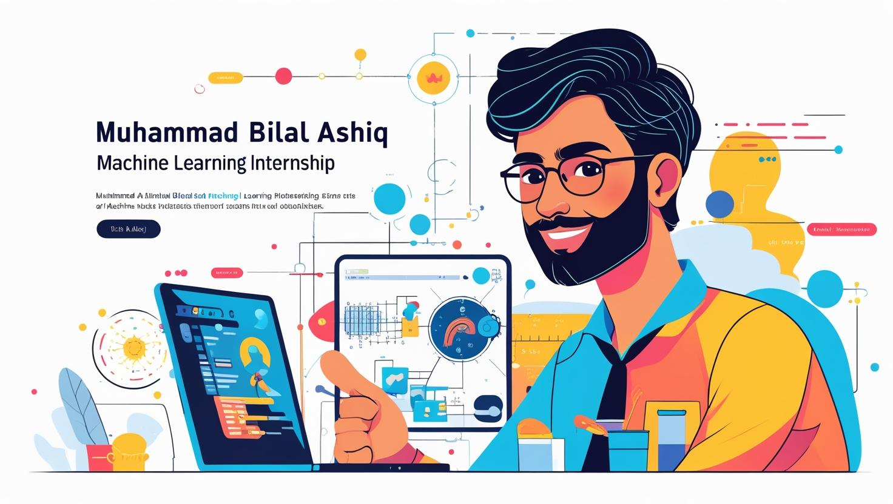

<h1 align="center">🚀 Machine Learning Internship Tasks 🎯</h1>

  

---

<h3 align="center">💖 Support This Repository 💖</h3>

⭐ Star this repository if you found it helpful!  
📢 Share with your friends!  
👨‍💻 Follow for more tutorials!  

---

<h3 align="center">👨‍💻 Author: Muhammad Bilal Ashiq</h3>

  
  
  
  

